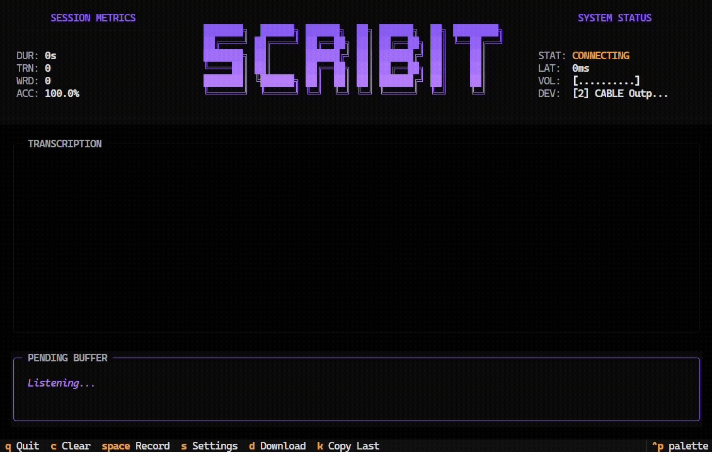

# Scribit

[](https://pypi.org/project/scribit/)
[](https://opensource.org/licenses/MIT)
[](https://www.python.org/downloads/release/python-3100/)

**Scribit is a high-performance real-time audio transcription engine with a developer-focused terminal interface.**

Powered by AssemblyAI's Streaming API and the Textual framework, it provides an elegant way to capture and log speech instantly.



## Features

- **Sleek TUI**: A dark-themed terminal interface built with Textual.
- **Real-time Transcription**: Powered by AssemblyAI's Streaming API.
- **Toggle Recording**: Start and stop transcription dynamically using the `Space` key.
- **In-App Settings**: Change your API key, audio device, and logging preferences without restarting.
- **Persistent Configuration**: Settings are saved locally in `settings.json`.
- **Transcript Logging**: Option to automatically save session transcripts to timestamped files.
- **Session Stats**: Monitor duration and turn count in real-time.

### From PyPI
```bash
pip install scribit
```

### From Source
1.  **Clone the repository**:
    ```bash
    git clone https://github.com/leo01102/scribit.git
    cd scribit
    ```
3.  **Install the package**:
    ```bash
    pip install .
    ```
    Alternatively, for development use:
    ```bash
    pip install -e ".[dev]"
    ```

## Usage

Once installed, simply run the following command in your terminal:
```bash
scribit
```

### Controls

1.  **Configure API Key**:
    - Press `S` to open the Settings menu.
    - Paste your AssemblyAI API key and press `Save`.
2.  **Start Recording**: Press `Space` to begin transcription.
3.  **Stop Recording**: Press `Space` again to pause/stop.
4.  **Clear Log**: Press `C` to clear the current transcription log.
5.  **Quit**: Press `Q` to exit the application.

### Key Bindings

| Key     | Action                 |
| :------ | :--------------------- |
| `Space` | Start/Stop Recording   |
| `S`     | Open Settings Menu     |
| `D`     | Download Session (.md) |
| `C`     | Clear Session Memory   |
| `Q`     | Quit Application       |

### Storage Location
Scribit now follows platform standards for data storage:
- **Windows**: `AppData/Local/scribit`
- **macOS**: `~/Library/Application Support/scribit`
- **Linux**: `~/.config/scribit`

## Technical Details

- **Transcription Engine**: AssemblyAI Streaming (v3).
- **Default Device**: Set to index 2 (configurable in settings).
- **Logs**: Saved in the `logs/` directory if enabled.
- **Environment**: Initial API keys can be loaded from a `.env` file.

## License

This project is licensed under the MIT License.
